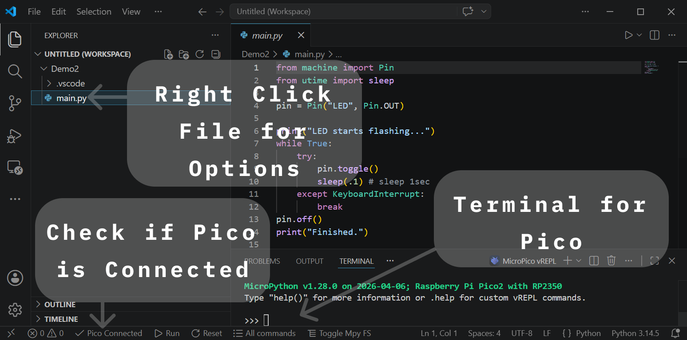
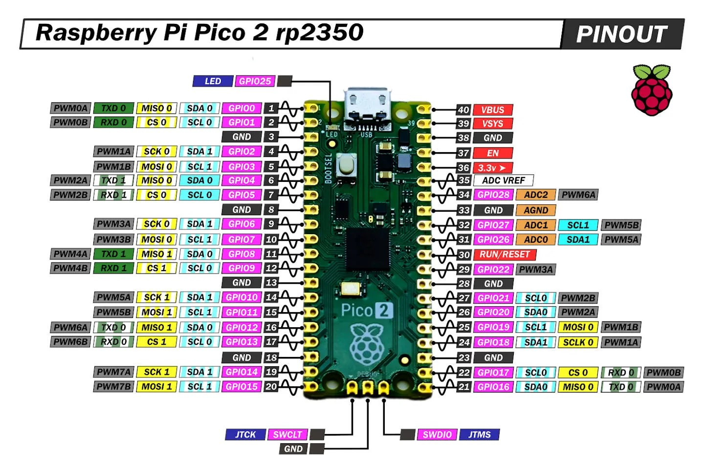

# Starting with the Pico


## Chapters
1. [Flashing the Pico](#1-flashing-the-pico)
2. [Setup Microcontroller Coding Environment](#2-setup-microcontroller-coding-environment)
3. [Using VSCode with the Pico](#3-using-vscode-with-the-pico)
4. [Buzzer Demo](#4-buzzer-demo)

## 1. Flashing the Pico

### Files:
Python Flash File:

- [MicroPython](https://micropython.org/download/): [Pico](https://micropython.org/download/RPI_PICO/), [Pico W](https://micropython.org/download/RPI_PICO_W/), [Pico 2](https://micropython.org/download/RPI_PICO2/), [Pico 2 W](https://micropython.org/download/RPI_PICO2_W/)
- [CircuitPython](https://circuitpython.org/downloads): [Pico](https://circuitpython.org/board/raspberry_pi_pico/), [Pico W](https://circuitpython.org/board/raspberry_pi_pico_w/), [Pico 2](https://circuitpython.org/board/raspberry_pi_pico2/), [Pico 2 W](https://circuitpython.org/board/raspberry_pi_pico2_w/)

### Steps:
Download the matching `.uf2` file for your board, then:

- Hold the **BOOTSEL** button on the Pico
- Plug the Pico into your computer via USB (keep holding BOOTSEL)
- Release BOOTSEL — the Pico mounts as a USB drive named `RPI-RP2`
- Drag the `.uf2` file onto the `RPI-RP2` drive
- The Pico auto-reboots and runs the new firmware (drive disappears)

## 2. Setup Microcontroller Coding Environment

Coding for the Pico is a bit different from typical desktop or web development. Instead of compiling and running code on the same machine where you write it, your code is transferred to the Pico to execute on its hardware. This means your tooling needs to handle file transfer and a serial REPL — things traditional IDEs don't do out of the box.

### Thonny

Beginner-friendly Python IDE with built-in MicroPython support.

- **Install:** download from [thonny.org](https://thonny.org/) — pick MicroPython (Raspberry Pi Pico) as the interpreter in Tools > Options
- **Pros:**
  - Works out of the box, no extensions to wire up
  - Built-in REPL and file manager for the Pico
  - Auto-detects connected boards
- **Cons:**
  - Bare-bones editor (no real autocomplete, no git integration)
  - Awkward for projects with more than a few files
  - Python only

Best for first-time users, students, and quick experiments where setup time should be near zero.

### VSCode

General-purpose editor with extensions that add Pico support.

- **Install:** download [VS Code](https://code.visualstudio.com/), then add the official [Raspberry Pi Pico extension](https://marketplace.visualstudio.com/items?itemName=raspberry-pi.raspberry-pi-pico) (recommended — first-party, handles SDK + toolchain setup for C/C++ and MicroPython). Alternatives: [MicroPico](https://marketplace.visualstudio.com/items?itemName=paulober.pico-w-go), Pymakr, or PlatformIO.
- **Pros:**
  - Real editing features: autocomplete, linting, multi-file projects
  - Git, terminal, and any other extension you already use
  - Same workflow whether you're writing Pico code or anything else
- **Cons:**
  - More moving parts to configure (extension, interpreter path, board selection)
  - Heavier install than Thonny
  - REPL integration varies by extension

Best for developers already comfortable with VS Code who want one tool for everything, or for larger Pico projects with multiple files and git history.

### Without an IDE

Any text editor plus a command-line tool to push files and open the REPL.

- **Install:** `pip install mpremote` (official MicroPython tool) or `pip install rshell` as an alternative
- **Pros:**
  - Minimal — no GUI, scriptable, easy to automate
  - Works over SSH or in CI
  - Editor-agnostic (Vim, Emacs, nano, whatever)
- **Cons:**
  - No autocomplete or board-aware tooling unless you wire it up yourself
  - File sync is manual (`mpremote cp`)
  - Higher learning curve for beginners

Best for terminal-focused users, headless/remote setups, or anyone scripting deploys to multiple boards.

## 3. Using VSCode with the Pico

This chapter walks through connecting a Pico to VS Code with the official Raspberry Pi Pico extension and getting a fresh MicroPython project ready to run.

1. **Install VS Code** from [code.visualstudio.com](https://code.visualstudio.com/) and launch it.
2. **Install the Raspberry Pi Pico extension** — open the Extensions sidebar (`Ctrl+Shift+X`), search for "Raspberry Pi Pico", and install the one published by `raspberry-pi`.
   - First launch will prompt to download the Pico SDK and toolchain — let it finish; this can take a few minutes.
   - On Windows, accept any driver / firewall prompts that appear.
3. **Flash MicroPython onto the Pico** following the [Flashing the Pico](#1-flashing-the-pico) chapter above.
   - Skip this step if you're writing C/C++ instead — the extension will compile and flash `.uf2` builds for you.
4. **Plug the Pico into your computer via USB** (a normal boot this time — do *not* hold BOOTSEL).
   - Windows: confirm the board shows up in Device Manager under "Ports (COM & LPT)" as a USB serial device.
   - macOS/Linux: check that a new `/dev/tty.usbmodem*` (mac) or `/dev/ttyACM*` (linux) device appears.
   - If nothing shows up, try a different USB cable — many cables are power-only and won't enumerate data.
5. **Open the Pico extension panel** by clicking the Raspberry Pi icon in the left sidebar.
6. **Create or open a project folder** — use "New MicroPython Project" from the extension panel, or `File > Open Folder` on an existing one.
   - The extension will drop a `.vscode/` config and stub files so autocomplete works.
   - Use a local path for the project, not the Pico
7. **Connect to the board** — in the extension panel (or the status bar at the bottom), pick the COM/serial port for your Pico.
   - It may automatically say "Pico Connected" at the bottom, if so, you are setup and done
   - If multiple ports are listed and you're not sure which is the Pico, unplug it, note which port disappears, and plug it back in.



## 4. Buzzer Demo

A first "real" project: make a 3-pin active buzzer module beep on a timer. Only a Pico and Buzzer module are needed.

### What's an active buzzer?

An **active buzzer** has its own oscillator built in — you just turn it on or off, and it makes a single fixed-pitch tone.

These modules have three pins:

- **VCC** — power (3.3 V works for most; 5 V if the module is labeled that way)
- **GND** — ground
- **S** — signal (HIGH = beep, LOW = silent)

### Wiring

- Buzzer **VCC** → Pico **3V3** (pin 36 — or any pin labeled `3V3` or `+` on the Omnibus)
- Buzzer **GND** → Pico **GND** (or any `GND` / `-` pin)
- Buzzer **S** → Pico **GP15** (or any free GPIO — just match the pin number in code)

Current draw is well under 30 mA, so USB power into the Pico is plenty.

### Code

```python
from machine import Pin
from time import sleep

buzzer = Pin(15, Pin.OUT)

while True:
    buzzer.value(1)   # on
    sleep(0.2)
    buzzer.value(0)   # off
    sleep(0.8)
```

### How it works

- `Pin(15, Pin.OUT)` configures GP15 as a digital output (change `15` to a different number if using a different GPIO pin).
- `buzzer.value(1)` drives the pin HIGH (3.3 V), which tells the buzzer module's internal oscillator to make sound.
- `buzzer.value(0)` drives it LOW (0 V), silencing it.
- `sleep(x)` pauses the program for `x` seconds.

### Things to try next

- Modify the loop to make it more diverse.
- Change the `sleep` values to make the beep faster or slower.
- Add a button on another GPIO and only beep while it's pressed (doorbell).
- Read the Pico's internal temperature sensor and beep when it crosses a threshold.
