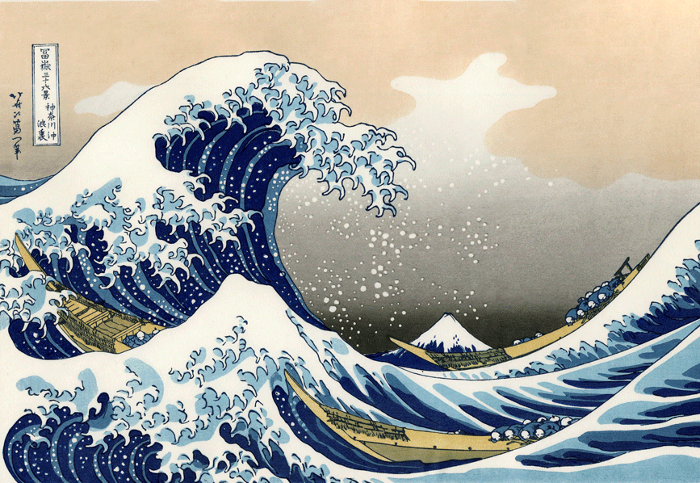

# Project-Compilation
Small coding projects for learning.

## Great waves painting
This is a painting I fond when I searched art in Google. For this image I downloaded the image localy and linked it in here locally.     

For this image I linked it using a URL of the actual image.  

## Pros and Cons of each methods

### Method 1: Local download

#### Pros
- As long as the image stays local it will never dissapear.

#### Cons

- This method takes a bit longer to do as you have to download the file then put it in.
- This method also requires download space.

### Method 2: URL link

#### Pros
- This method is easy and fast as you only have to copy and paste the link.
- This method does not take up any disk space as it is stored in data centers.

#### Cons
- If this URL is ever taken down the image would dispay the error text.
